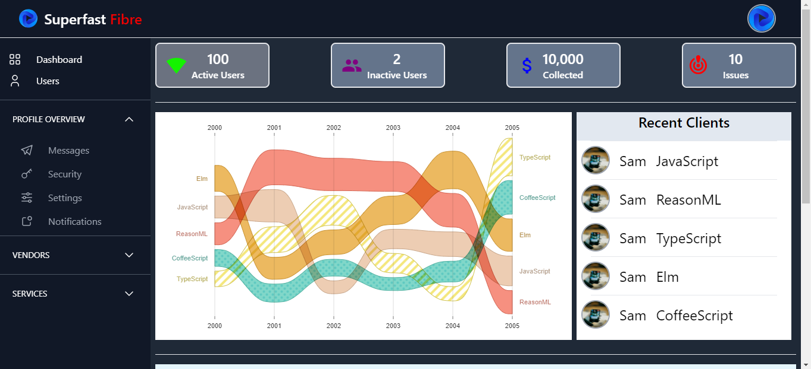

[](https://skills.thijs.gg)
## JETNET Fibre DashBoard
This is a Dashboard build to manage clients and Automate Revenue Collection for Superfast Fast Fibre.
To Run this repo after pulling, follow the following steps:

1. Install Modules 
>```npm install --legacy-peer-deps```
2. Run Project
>``` yarn run dev```                                           

## UI Design
 